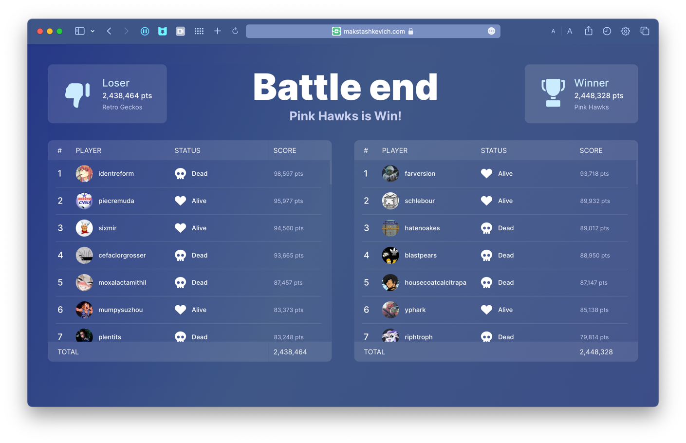

# Post-battle Screen Design

### Introduction

You need to design and implement a functional post-battle screen for a session based game.

### Main Task
There are two teams, the winning team and loser team. Each team consists of 50 players.
The teams should be organized side by side. 
Each player has a nickname and scores and can be in two states, dead or alive. 
Also, there should be a tooltip with additional player info (total kills and deaths) and a button to send a friend request.

### Additional Task (Optional)
Implement a dummy backend for the task using any of REST/graphQL/GRPC.

## My solution

It was decided to use the scoreboard (table) for a more comfortable user experience (UX) with the ability to scroll through the list of players of each team.

### Figma Design Concept

[See Figma Project](https://www.figma.com/file/NtSeuqvFEkkqwD5OYyEStB/Post-battle-screen?node-id=0%3A1&t=05zFtkKufIoTPmdm-1)

### Demo

[See Demo Site](https://makstashkevich.com/post-battle-screen/demo/)

## How to install project

### Download project to local machine

`git clone && cd ./post-battle-screen-design`

### Developing frontend UI

> **Warning:** You need install `yarn` on you local machine.

Run this command on root folder for build frontend: 

`cd frontend && yarn start`

### Developing backend API

> **Warning:** You need install `python3.10` on you local machine.

Run this command on root folder: 

`cd api && pip3 install -r requirements.txt && sudo chmod +x start-local.sh && sudo ./start-local.sh`

## Build Docker for production

Before use Docker on dedicate server you need run this command:

`sudo chmod +x install_docker_engine.sh && sudo ./install_docker_engine.sh`

Run command on root folder to auto-install & auto-build Docker compose: 

`sudo chmod +x build.sh && sudo ./build.sh`

For delete all run containers force, run script with `-f` argument:

`sudo ./build.sh -f`